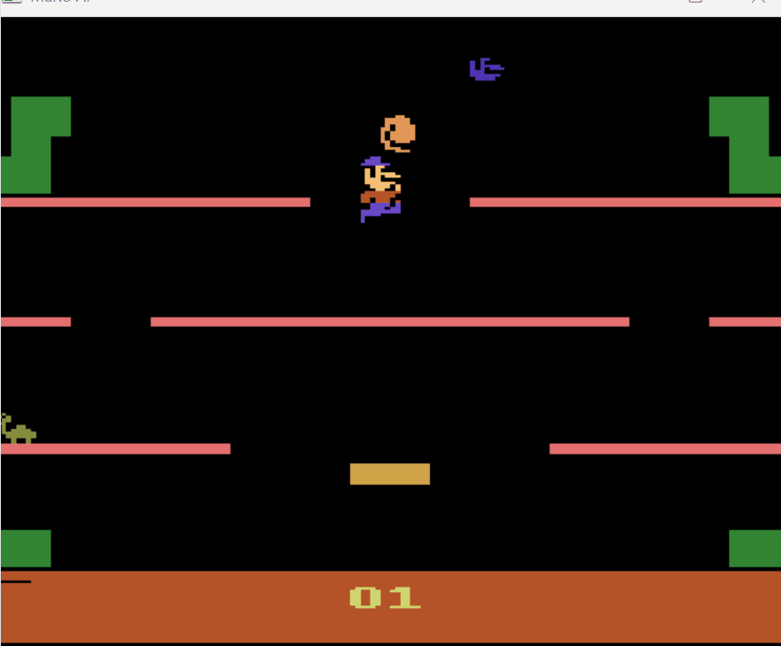

# 🍄 Mario AI Bot — Self-Playing Mario with Reinforcement Learning


An AI that learns to play Mario Bros completely by itself using Deep Reinforcement Learning (PPO algorithm). Watch it go from a complete beginner to beating levels on its own!


---

## 🎮 Demo



The AI starts knowing nothing and learns purely through trial and error — just like a human would!

- ✅ Learns to move right
- ✅ Learns to jump over obstacles
- ✅ Gets better every hour of training
- ✅ Watch it learn in real time through a live window

---

## 🧠 How It Works

This project uses:
- **PPO (Proximal Policy Optimization)** — a powerful reinforcement learning algorithm
- **CNN (Convolutional Neural Network)** — lets the AI see the game screen
- **OpenAI Gymnasium + ALE** — provides the game environment
- **Stable Baselines3** — handles the AI training

The AI sees the game screen as pixels, tries random actions at first, and slowly learns which actions give it the best reward. Over thousands of attempts it gets better and better.

---

## 🚀 Quick Start

### 1. Clone the repo
```bash
git clone https://github.com/YOURUSERNAME/mario-ai-bot.git
cd mario-ai-bot
```

### 2. Create virtual environment
```bash
python -m venv venv
venv\Scripts\activate
```

### 3. Install dependencies
```bash
pip install -r requirements.txt
AutoROM --accept-license
```

### 4. Run the bot
```bash
python mario_bot.py
```

### 5. Pick an option from the menu
```
1. Train AI - hidden window (FASTER)
2. Train AI - visible window (watch Mario learn)
3. Watch trained AI play Mario
```

---

## ⏱️ Training Time

| Timesteps | Time | Skill Level |
|-----------|------|-------------|
| 100,000 | ~15 mins | Barely moves |
| 500,000 | ~1 hour | Learning to jump |
| 1,000,000 | ~2-3 hours | Getting decent |
| 5,000,000 | ~10 hours | Pretty good! |

💡 Progress is saved automatically so you can stop and continue anytime!

---

## 💻 Requirements

- Python 3.11
- Windows 10/11
- 8GB RAM minimum
- No GPU needed — runs on CPU!

---

## 📦 Tech Stack

| Tool | Purpose |
|------|---------|
| PyTorch 2.0.0 | Neural network |
| Stable Baselines3 | PPO algorithm |
| Gymnasium + ALE | Game environment |
| OpenCV | Screen processing |
| Python 3.11 | Language |

---

## 🕹️ Other Games You Can Train

Just change the game name in the code — same bot works for all of these:

| Game | Code |
|------|------|
| Pac-Man | `ALE/MsPacman-v5` |
| Space Invaders | `ALE/SpaceInvaders-v5` |
| Breakout | `ALE/Breakout-v5` |
| Pong | `ALE/Pong-v5` |
| Donkey Kong | `ALE/DonkeyKong-v5` |

---

## 🌟 Support the Project

If you found this useful or interesting please give it a ⭐ — it helps others find it!

---

## 📜 License

MIT License — free to use for anything!
